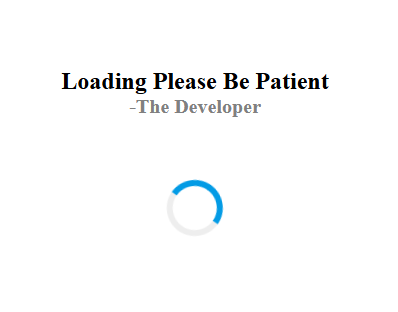

# ⏳ CSS Loading Screen

A simple and visually appealing **loading screen animation** built using **HTML and CSS**.
This project demonstrates how CSS animations can be used to create engaging UI elements while a webpage or application loads.

---

## 📸 Preview

<p align="center">
  
</p>

---

## 🚀 Features

* Smooth CSS loading animation
* Built using only **HTML5 and CSS3**
* Lightweight and fast
* Easy to integrate into any website
* Beginner-friendly project

---

## 🛠️ Technologies Used

* HTML5
* CSS3
* CSS Animations (`@keyframes`)
* Flexbox

---

## 📂 Project Structure

```
Loading-page/
│
├── index.html
├── style.css
├── images
│   └── preview.png
└── README.md
```

---

## ▶️ How to Run

1. Clone the repository

```
git clone https://github.com/manmitha-matcha/loading-screen.git
```

2. Open the folder

3. Run the project by opening:

```
index.html
```

in your browser.

---

## 🎯 Purpose of the Project

This project was created to practice:

* HTML page structure
* CSS animations
* UI design concepts
* Frontend project organization

---

## 📄 License

This project is open-source and free to use for learning purposes.
